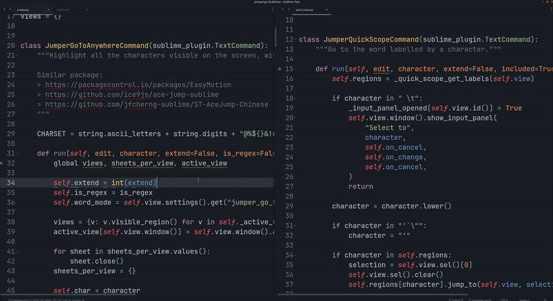
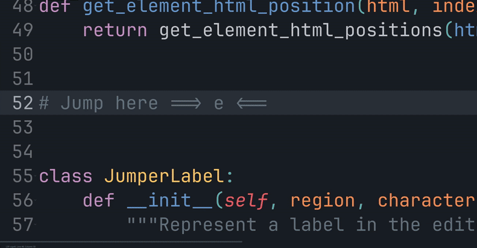
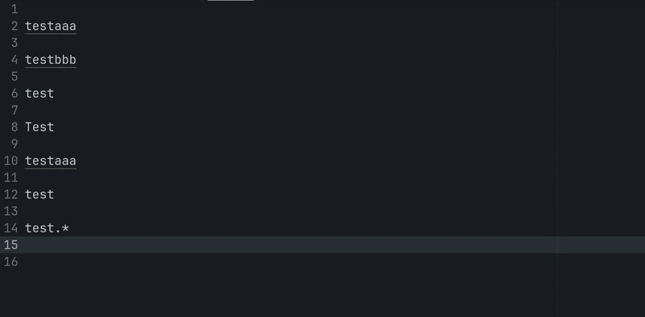
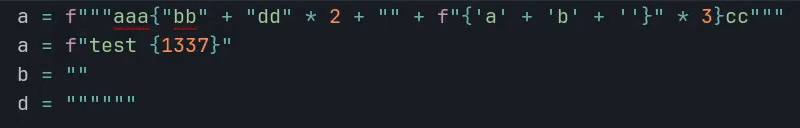
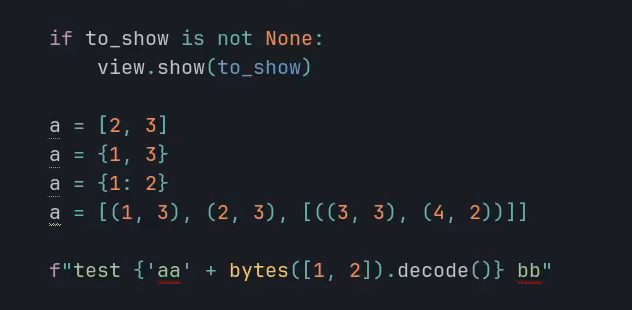

# Sublime - Jumper
## Go To Anywhere
Taking inspiration from [EasyMotion](https://github.com/tednaleid/sublime-EasyMotion) and [Ace Jump](https://github.com/acejump/AceJump), press a shortcut to label every match of a regex visible on the screen. Typing the label jumps to that position.

While the labels are shown, you can switch mode:
- "`enter`" then the label: select everything between the cursor and the target, target included (the color will change)
- "`tab`" then the label: select everything between the cursor and the target, target excluded (the color will change)
- "`|`" then the label: keep the current selection and add a new cursor at the target
- pressing the same key a second time (or backspace on an empty input) goes back to "jump" mode

<p align="center">
  
</p>

```json
{
    // Label all the words on the screen
    "keys": ["shift+find"],
    "command": "jumper",
    "args": {"regex": "\\w+"}
},
{
    // Label only the words of the current line
    // (press it a second time to label the whole screen)
    "keys": ["find"],
    "command": "jumper",
    "args": {"regex": "\\w+", "current_line": true}
},
```

The `extend` argument accepts the mode to start with: `1` select until the target excluded, `2` select until the target included, `3` add a new cursor at the target.

The labels are **derived from the matched text**: a match starting with a unique letter is labelled by that letter, so typing the first letter of your target usually jumps there directly. When several matches start with the same letter, longer labels are generated (preferring the following characters of the matched text).

You can change the charset used for the labels (the preferred characters first). Whitespace, "`enter`", "`tab`" and "`|`" can not be used, they are reserved to switch mode:

```json
{
    "jumper_charset": "ntesiroamglpufywjbhd,cxkv:z"
}
```

The jump works when many files are open, the labels stay unique across all the views. But the "select" and "add cursor" modes only show the labels of the current view (because we can not extend a selection between 2 files).

Taking inspiration from [Quick Scope](https://github.com/unblevable/quick-scope), the characters used by the labels of the current line can be underlined, so you know what to type before even starting the command. Set `jumper_quick_scope_regex` to the same regex as your `current_line: true` keybinding (or to `""` to disable the highlight):

```json
{"jumper_quick_scope_regex": "\\w+"}
```

With `jumper_escalate_line_to_screen`, pressing the "current line" shortcut a second time re-executes the command on the whole screen instead of only the current line.

With `jumper_case_sensitive`, you can make the search and the labels case sensitive (insensitive by default `false`).

When a label has more characters than the matched text can display, borders are shown around the last visible character. They will disappear while you type the label.

<p align="center">
  
</p>


## Technical
Sublime text doesn't support "phantom on top of text", so the default implementation use HTML sheet.

You can check the branch `master-all-labels-methods` to see all possible way to add labels
- phantoms: the text will shift to the right
- buffer: we will change the buffer, but the "redo" history can not be cleaned
- popup: we show a popup, but you will see a shadow and you can not jump to the first line
- sheet: the default implementation, only drawback is that when you are in "label typing" mode, you can not select text with the mousse

## Select Next Selection Match
The command `select_next_same_selection` will select the next / previous text matching the current selection
(you can also add it to the current selection, and it will be the same as `find_under_expand`).

Like `find_under_expand`,
- if you press the shortcut when no text selected, then it will search for the whole word
- if you press the shortcut when a text is selected, then it will select the next text (whole word or not)
- the difference is that you can go backward, and that it is always case sensitive

<p align="center">
  
</p>

A dot is displayed in the gutter for the "main cursors" when they are many (the cursor from which the selection will be extended).

That dot is "green" when in "text mode", or blue when in "word mode" (you pressed the shortcut without selecting anything).

## Select Selector

<p align="center">
  
</p>

The command `jumper_select_selector` select the next / previous text matching the sublime selector.

The idea is to have something similar than "select inside parenthesis" command of Vim.

See:
- https://www.sublimetext.com/docs/scope_naming.html
- https://www.sublimetext.com/docs/selectors.html

By default, the selector match the strings.

```json
// Select next / previous strings
{
    "keys": ["alt+ctrl+super+'"],
    "command": "jumper_select_selector"
},
{
    "keys": ["alt+ctrl+super+`"],
    "command": "jumper_select_selector",
    "args": {"direction": "previous"}
},
{
    "keys": ["shift+alt+ctrl+super+'"],
    "command": "jumper_select_selector",
    "args": {"extend": true}
},
{
    "keys": ["shift+alt+ctrl+super+`"],
    "command": "jumper_select_selector",
    "args": {"direction": "previous", "extend": true}
},
// Select next / previous class / function
{
    "keys": ["alt+ctrl+super+f"],
    "command": "jumper_select_selector",
    "args": {"selector": "entity.name"}
},
{
    "keys": ["alt+ctrl+super+w"],
    "command": "jumper_select_selector",
    "args": {"direction": "previous", "selector": "entity.name"}
}
// next / previous condition / loop
{
    "keys": ["alt+ctrl+super+i"],
    "command": "jumper_select_selector",
    "args": {
        "selector": "keyword.control.conditional | keyword.control.loop - keyword.control.loop.for.in",
    }
},
{
    "keys": ["alt+ctrl+super+e"],
    "command": "jumper_select_selector",
    "args": {
        "direction": "previous",
        "selector": "keyword.control.conditional | keyword.control.loop - keyword.control.loop.for.in",
    }
},
{
"keys": ["shift+alt+ctrl+super+i"],
    "command": "jumper_select_selector",
    "args": {
        "extend": true,
        "selector": "keyword.control.conditional | keyword.control.loop - keyword.control.loop.for.in",
    }
},
{
"keys": ["shift+alt+ctrl+super+e"],
    "command": "jumper_select_selector",
    "args": {
        "selector": "keyword.control.conditional | keyword.control.loop - keyword.control.loop.for.in",
        "direction": "previous",
        "extend": true
    }
},
```

Use `trim_selector` to remove matching syntax tokens from the beginning and end
of each result while keeping matching tokens inside the content (even if empty).
```json
{
    "keys": ["alt+primary+super+4"],
    "command": "jumper_select_selector",
    "args": {
        "selector": "comment",
        "trim_selector": "punctuation",
        "trim": true
    }
}
```

## Select Next / Previous Bracket Content
Select the content of the next / previous `(){}[]` (using selector, to skip false positive).

<p align="center">
  
</p>


```json
{
    "keys": ["alt+ctrl+super+]"],
    "command": "jumper_select_next_bracket",
},
{
    "keys": ["alt+ctrl+super+["],
    "command": "jumper_select_next_bracket",
    "args": {"direction": "previous"}
},
{
    "keys": ["shift+alt+ctrl+super+]"],
    "command": "jumper_select_next_bracket",
    "args": {"extend": true}
},
{
    "keys": ["shift+alt+ctrl+super+["],
    "command": "jumper_select_next_bracket",
    "args": {"direction": "previous", "extend": true}
},
```

Or if you want to select the next / previous parenthesis content:
```json
{
    "keys": ["alt+ctrl+super+]"],
    "command": "jumper_select_next_bracket",
    "args": {
      "brackets_text": "()"
    },
},
{
    "keys": ["alt+ctrl+super+["],
    "command": "jumper_select_next_bracket",
    "args": {"direction": "previous", "brackets_text": "()"}
},
{
    "keys": ["shift+alt+ctrl+super+]"],
    "command": "jumper_select_next_bracket",
    "args": {"extend": true, "brackets_text": "()"}
},
{
    "keys": ["shift+alt+ctrl+super+["],
    "command": "jumper_select_next_bracket",
    "args": {"direction": "previous", "extend": true, "brackets_text": "()"}
}
```

If you are inside `()`, selecting "previous ()" will select the parent parenthesis, while selecting "next ()" will select the next one.

## Go To Previous Modification
["Go To Modification" on steroid. (see demo)](https://youtu.be/QUIU8pPL6QE) The command `jumper_previous_modification` allow you to go to the next / previous modification, even if it was
- in a different tab
- in a different panel
- in a different window
- in a non-saved sheet

It will remember where the file was opened, and try to re-open it at the same place if possible (if not, it will re-open the file in the current window).

By default, it won't jump many time on the same line.

You can also go to next / previous modified file.

```json
{
    "keys": ["ctrl+,"],
    "command": "jumper_previous_modification"
},
{
    "keys": ["ctrl+."],
    "command": "jumper_previous_modification",
    "args": {"direction": "next"}
},
{
    "keys": ["ctrl+shift+,"],
    "command": "jumper_previous_modification",
    "args": {"per_file": true}
},
{
    "keys": ["ctrl+shift+."],
    "command": "jumper_previous_modification",
    "args": {"direction": "next", "per_file": true}
},
```

If it open a new sheet, it will be closed automatically if no modification are made inside.

Run the command `jumper_previous_modification_panel` to open a panel with the history.

# TODO
- Find a way to add letter as row number to jump faster, once https://github.com/sublimehq/sublime_text/issues/6654 is done
- "Go To Anywhere", when clicking on a tab, the input panel should close
- Improve `select_selector` once https://github.com/sublimehq/sublime_text/issues/6660 is fixed
